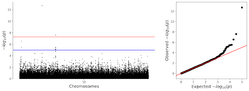
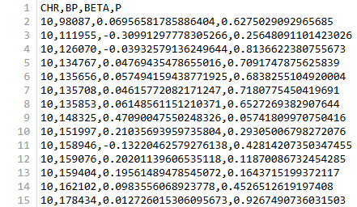

# lightweight-GWAS

## Description
lightweight-GWAS is a simple tool designed to quickly generate interpretable genome-wide association study (GWAS) results through linear regression.  

## Installation
This tool can be installed and run from the command line directly. A singularity definition file and requirements.txt are included, but dependency versioning is not strict. See sections below for examples on how to run the script.

Clone the repository directly 
```sh
John_Doe@ubuntu:~$ git clone https://github.com/Siddharth-Gaywala/GWAS.git .
```

Create a new environment and install the required dependencies:
```sh
John_Doe@ubuntu:~$ micromamba create -n lightweight-GWAS python=3.11
John_Doe@ubuntu:~$ micromamba activate lightweight-GWAS
(lightweight-GWAS) John_Doe@ubuntu:~$ pip install -r /Users/John_Doe/GWAS/requirements.txt
```

Alternatively, if working in a high performance computing environment, build the singularity container image:
```sh
John_Doe@ubuntu:~$ singularity build lightweight-GWAS_cont.sif lightweight-GWAS_cont.def
```

## Arguments
There are three mandatory arguments:   
```sh
--vcf: Path to valid VCF file  
--phenotype: Path to valid phenotype file   
--out: Prefix for analysis results  
```

There are two optional arguments: 
```sh
--covariates: Path to covariates file  
--pca_covariates: Boolean(as a string) to indicate whether PCA should be run on genotypes as an alternative covariates method
```

## Example run
```sh
(lightweight-GWAS) John_Doe@ubuntu:~$ /Users/John_Doe/GWAS/lightweight-GWAS.py --vcf /mnt/data/genotypes.vcf --phenotype /mnt/data/phenotypes.phen --out example --covariates /mnt/data/covariates.cov --pca_covariates False
```

## Outputs 
The tool will save the following results to the directory it was called from with provided prefix:
- outprefix_manhattan.png
- outprefix_analysis_results.csv

Examples:  
 
